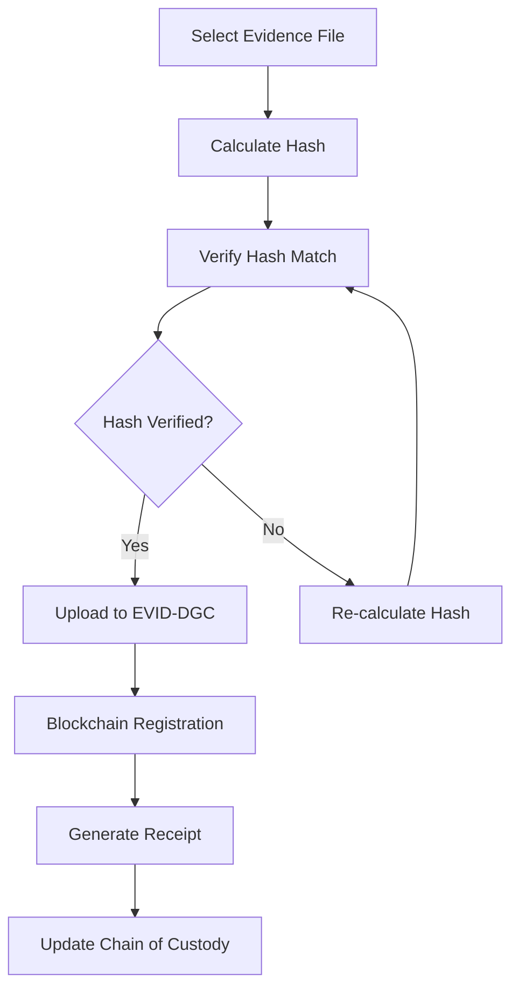

# Forensic Analysts Guide for Secure Evidence Collection & Verification

## Table of Contents
1. [Introduction](#introduction)
2. [System Overview](#system-overview)
3. [Evidence Registration Process](#evidence-registration-process)
4. [Safe Hashing & Upload Workflows](#safe-hashing--upload-workflows)
5. [Chain of Custody Management](#chain-of-custody-management)
6. [Evidence Integrity Verification](#evidence-integrity-verification)
7. [Best Practices](#best-practices)
8. [Integration with Standard Tools](#integration-with-standard-tools)
9. [Compliance Standards](#compliance-standards)
10. [Troubleshooting](#troubleshooting)

## Introduction

EVID-DGC (Evidence Digital Chain) is a blockchain-based evidence management system designed to maintain the integrity and chain of custody of digital evidence throughout the forensic investigation process. This guide provides forensic analysts with comprehensive instructions for secure evidence collection, registration, and verification using the EVID-DGC platform.

### Key Benefits for Forensic Analysts
- **Immutable Evidence Records**: All evidence is cryptographically hashed and stored on blockchain
- **Automated Chain of Custody**: Every access and modification is automatically logged
- **Real-time Verification**: Instant integrity verification against blockchain records
- **Standards Compliance**: Aligned with ISO 27037 and NIST digital forensics guidelines
- **Audit Trail**: Complete forensic audit trail for court presentation

## System Overview

### Architecture Components
```
┌─────────────────┐    ┌─────────────────┐    ┌─────────────────┐
│   Forensic      │    │   EVID-DGC      │    │   Blockchain    │
│   Workstation   │◄──►│   Platform      │◄──►│   Network       │
└─────────────────┘    └─────────────────┘    └─────────────────┘
         │                       │                       │
         │                       │                       │
         ▼                       ▼                       ▼
┌─────────────────┐    ┌─────────────────┐    ┌─────────────────┐
│   Evidence      │    │   Secure        │    │   Distributed   │
│   Storage       │    │   Database      │    │   Hash Store    │
└─────────────────┘    └─────────────────┘    └─────────────────┘
```

### Security Features
- **SHA-256 Cryptographic Hashing**: Industry-standard evidence integrity verification
- **Blockchain Immutability**: Tamper-proof evidence records
- **Role-Based Access Control**: Granular permissions for forensic team members
- **Encrypted Storage**: Evidence files encrypted at rest and in transit
- **Multi-Factor Authentication**: Enhanced security for forensic analyst accounts

## Evidence Registration Process

### Step 1: Pre-Registration Checklist

Before registering evidence in EVID-DGC, ensure:

✅ **Physical Evidence Secured**
- Evidence properly bagged and labeled
- Chain of custody forms initiated
- Photography completed

✅ **Digital Evidence Prepared**
- Forensic imaging completed using write-blocking tools
- Hash values calculated using multiple algorithms
- Working copies created for analysis

✅ **Documentation Ready**
- Case number assigned
- Evidence description prepared
- Collection metadata documented

### Step 2: System Access

1. **Login to EVID-DGC**
   ```
   URL: https://evid-dgc.onrender.com
   Role: Forensic Analyst
   Authentication: MetaMask + 2FA (recommended)
   ```

2. **Verify System Status**
   - Check blockchain connectivity indicator (green = connected)
   - Confirm storage system availability
   - Verify your analyst permissions

### Step 3: Case Association

1. **Select Existing Case**
   - Navigate to "Cases" dashboard
   - Search by case number or title
   - Click "Add Evidence" button

2. **Create New Case** (if authorized)
   - Click "Create New Case"
   - Enter case details:
     - Case Number
     - Case Title
     - Investigation Type
     - Assigned Personnel
   - Save case information

### Step 4: Evidence Registration

1. **Access Evidence Upload Interface**
   - From case detail page, click "Add Evidence"
   - Select "Forensic Evidence Upload"

2. **Complete Evidence Form**
   ```
   Evidence ID: [Auto-generated or manual entry]
   Evidence Name: [Descriptive name]
   Evidence Type: [Select from dropdown]
   Collection Date: [Date/time of collection]
   Collection Location: [Physical location]
   Collected By: [Officer/analyst name]
   Chain of Custody: [Upload custody form]
   ```

3. **File Upload Process**
   - Select evidence file(s)
   - System automatically calculates SHA-256 hash
   - Verify hash matches your pre-calculated value
   - Add file description and metadata

## Safe Hashing & Upload Workflows

### Pre-Upload Hash Calculation

**Using Command Line Tools:**

```bash
# Windows (PowerShell)
Get-FileHash -Path "evidence.img" -Algorithm SHA256

# Linux/macOS
sha256sum evidence.img

# Verify multiple algorithms
md5sum evidence.img
sha1sum evidence.img
sha256sum evidence.img
```

**Using Forensic Tools:**
- **FTK Imager**: Built-in hash calculation during imaging
- **EnCase**: Automatic hash verification
- **Autopsy**: Hash calculation in case management
- **X-Ways Forensics**: Multiple hash algorithm support

### Upload Workflow



### Upload Security Measures

1. **Network Security**
   - Use secure, encrypted connection (HTTPS)
   - Verify SSL certificate validity
   - Use VPN if accessing remotely

2. **File Integrity**
   - Hash verification before upload
   - Chunked upload with integrity checks
   - Automatic re-upload on corruption detection

3. **Access Logging**
   - All upload activities logged
   - Timestamp and user identification
   - IP address and session tracking

## Chain of Custody Management

### Digital Chain of Custody

EVID-DGC automatically maintains digital chain of custody through:

1. **Immutable Timestamps**
   - Blockchain-based timestamping
   - Cannot be altered or backdated
   - Cryptographically verifiable

2. **Access Tracking**
   - Every file access logged
   - User identification required
   - Purpose of access documented

3. **Transfer Records**
   - Automatic logging of evidence transfers
   - Digital signatures for authorization
   - Notification system for stakeholders

### Manual Chain of Custody Integration

1. **Physical Custody Forms**
   - Upload scanned custody forms
   - Link to digital evidence records
   - Maintain parallel documentation

2. **Custody Transfer Process**
   ```
   1. Initiate transfer in EVID-DGC
   2. Specify recipient and purpose
   3. Generate transfer authorization
   4. Recipient confirms receipt
   5. System updates custody record
   6. Notifications sent to stakeholders
   ```

### Court-Ready Documentation

Generate comprehensive custody reports:

1. **Access Report Generation**
   - Navigate to evidence detail page
   - Click "Generate Custody Report"
   - Select date range and detail level
   - Download PDF report

2. **Report Contents**
   - Complete access history
   - User identification and roles
   - Timestamps and actions taken
   - Hash verification results
   - Blockchain transaction records

## Evidence Integrity Verification

### Real-Time Verification

**Automatic Verification:**
- System continuously monitors file integrity
- Compares current hash with blockchain record
- Alerts on any discrepancies
- Maintains verification log

**Manual Verification:**
1. Navigate to evidence item
2. Click "Verify Integrity"
3. System recalculates hash
4. Compares with blockchain record
5. Displays verification result

### Verification Process

```python
# Pseudo-code for verification process
def verify_evidence_integrity(evidence_id):
    # Get current file hash
    current_hash = calculate_sha256(evidence_file)
    
    # Retrieve blockchain record
    blockchain_hash = get_blockchain_record(evidence_id)
    
    # Compare hashes
    if current_hash == blockchain_hash:
        return "VERIFIED: Evidence integrity confirmed"
    else:
        return "ALERT: Evidence integrity compromised"
        
    # Log verification attempt
    log_verification_attempt(evidence_id, current_hash, blockchain_hash)
```

### Verification Scenarios

**✅ Successful Verification**
- Hash matches blockchain record
- Evidence integrity confirmed
- Safe to proceed with analysis

**⚠️ Verification Warning**
- Minor metadata changes detected
- Core evidence data intact
- Review changes before proceeding

**❌ Verification Failure**
- Hash mismatch detected
- Evidence may be compromised
- Immediate investigation required

## Best Practices

### Evidence Collection

1. **Use Write-Blocking Tools**
   - Hardware write blockers for physical media
   - Software write protection for logical imaging
   - Verify write-blocking functionality before use

2. **Multiple Hash Algorithms**
   - Calculate MD5, SHA-1, and SHA-256 hashes
   - Store all hash values in case documentation
   - Use for cross-verification purposes

3. **Forensic Imaging Standards**
   - Create bit-for-bit forensic images
   - Use industry-standard formats (E01, DD, AFF)
   - Maintain original evidence separately

### System Usage

1. **Regular Verification**
   - Verify evidence integrity weekly
   - Check blockchain connectivity daily
   - Monitor system alerts and notifications

2. **Documentation Standards**
   - Use consistent naming conventions
   - Include detailed evidence descriptions
   - Maintain comprehensive case notes

3. **Security Practices**
   - Use strong, unique passwords
   - Enable two-factor authentication
   - Log out when not actively using system

### Quality Assurance

1. **Peer Review**
   - Have colleague verify critical evidence
   - Cross-check hash calculations
   - Review case documentation for completeness

2. **Regular Audits**
   - Participate in system audits
   - Review access logs periodically
   - Validate evidence integrity reports

## Integration with Standard Tools

### FTK (Forensic Toolkit)

**Integration Steps:**
1. Complete imaging in FTK
2. Export hash values and metadata
3. Upload image files to EVID-DGC
4. Import FTK metadata into case record

**Hash Verification:**
```
FTK Hash: SHA256 = d4735f3a265e16eee03f59718b9b5d03019c07d8b6c51f90da3a666eec13ab35
EVID-DGC: SHA256 = d4735f3a265e16eee03f59718b9b5d03019c07d8b6c51f90da3a666eec13ab35
Status: ✅ VERIFIED
```

### EnCase

**Workflow Integration:**
1. Create EnCase evidence file (.E01)
2. Calculate verification hashes
3. Register in EVID-DGC with EnCase metadata
4. Link analysis results to evidence record

### Autopsy

**Case Management Integration:**
1. Create Autopsy case
2. Add evidence sources
3. Export case metadata to EVID-DGC
4. Maintain synchronized evidence records

### X-Ways Forensics

**Evidence Synchronization:**
1. Complete X-Ways analysis
2. Export evidence summary
3. Upload findings to EVID-DGC
4. Link analysis reports to evidence items

## Compliance Standards

### ISO 27037:2012 Compliance

**Digital Evidence Handling:**
- ✅ Identification and documentation
- ✅ Collection with integrity preservation
- ✅ Acquisition using validated tools
- ✅ Preservation of original evidence
- ✅ Chain of custody maintenance

**EVID-DGC Alignment:**
- Automated documentation processes
- Cryptographic integrity verification
- Immutable audit trails
- Role-based access controls

### NIST Guidelines Compliance

**NIST SP 800-86 Requirements:**
- ✅ Evidence collection procedures
- ✅ Examination methodology
- ✅ Analysis documentation
- ✅ Reporting standards

**Implementation in EVID-DGC:**
- Standardized collection workflows
- Integrated examination tools
- Automated analysis logging
- Court-ready report generation

### Legal Admissibility

**Requirements for Court Acceptance:**
1. **Authentication**: Evidence is what it purports to be
2. **Chain of Custody**: Continuous custody documentation
3. **Integrity**: Evidence has not been altered
4. **Relevance**: Evidence relates to the case

**EVID-DGC Support:**
- Blockchain-based authentication
- Automated custody tracking
- Cryptographic integrity verification
- Case-linked evidence organization

## Troubleshooting

### Common Issues

**Hash Mismatch Errors**
```
Problem: Calculated hash doesn't match expected value
Causes:
- File corruption during transfer
- Incorrect file selected
- Hash calculation error

Solutions:
1. Re-calculate hash using different tool
2. Verify file integrity at source
3. Re-transfer file if necessary
4. Contact system administrator if persistent
```

**Upload Failures**
```
Problem: Evidence file upload fails
Causes:
- Network connectivity issues
- File size limitations
- Insufficient storage space
- Permission restrictions

Solutions:
1. Check network connection
2. Verify file size limits
3. Contact administrator for storage
4. Confirm user permissions
```

**Blockchain Connectivity Issues**
```
Problem: Cannot connect to blockchain network
Causes:
- Network firewall restrictions
- Blockchain network congestion
- MetaMask configuration issues
- System maintenance

Solutions:
1. Check firewall settings
2. Wait for network recovery
3. Reconfigure MetaMask
4. Check system status page
```

### Support Resources

**Technical Support**
- Email: support@evid-dgc.com
- Phone: 1-800-EVID-DGC
- Online Chat: Available 24/7

**Documentation**
- User Manual: [Link to full documentation]
- Video Tutorials: [Link to training videos]
- FAQ: [Link to frequently asked questions]

**Training Resources**
- Forensic Analyst Certification Course
- Monthly Webinar Series
- Best Practices Workshop

### Emergency Procedures

**Evidence Integrity Compromise**
1. Immediately isolate affected evidence
2. Document all circumstances
3. Notify case supervisor
4. Contact EVID-DGC support
5. Preserve all logs and documentation

**System Outage**
1. Check system status page
2. Use offline verification tools
3. Document all activities
4. Resume normal operations when restored
5. Verify all evidence post-restoration

---

## Conclusion

EVID-DGC provides forensic analysts with a robust, secure platform for digital evidence management that meets the highest standards of forensic practice. By following the procedures outlined in this guide, analysts can ensure the integrity, authenticity, and admissibility of digital evidence throughout the investigation process.

For additional support or questions about specific procedures, please contact the EVID-DGC support team or refer to the comprehensive online documentation.

---

**Document Version**: 2.0  
**Last Updated**: January 2024  
**Next Review**: July 2024  

**Prepared by**: EVID-DGC Development Team  
**Reviewed by**: Digital Forensics Advisory Board  
**Approved by**: Chief Technology Officer